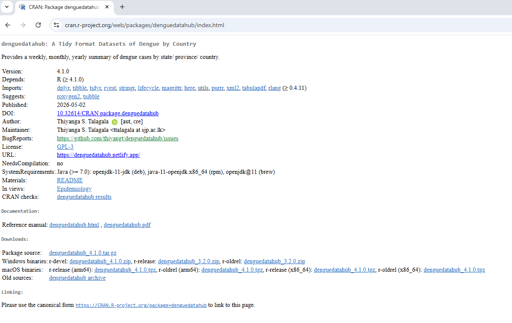

## NEWS

## 2026 May 02

Package version 4.1.0 is now available on [CRAN](https://cran.r-project.org/web/packages/denguedatahub/index.html)



## Package History

```{r, warning=FALSE, message=FALSE}
library(rvest)
library(dplyr)
nCRANArchived <- function(pkg = "denguedatahub") {
 link <- read_html(paste0("https://cran.r-project.org/src/contrib/Archive/", pkg ="denguedatahub"))
 link %>%
  html_node('table') %>%
  html_table() 
}
nCRANArchived()
```

## Press-release

1.  [Empowering Dengue Research Through the Dengue Data Hub: R Consortium Funded Initiative](https://r-consortium.org/posts/empowering-dengue-research-through-the-dengue-data-hub/)

## Conference Presentations

1.  [RMedicine Conference 2023](https://thiyangt.github.io/RMedicine/#1)

Talk title: Dengue Data Hub: A Centralized Repository for Dengue-related Data

Abstract

The goal of denguedatahub is to provide the research community with a unified dataset by collecting worldwide dengue-related data, merged with exogenous variables helpful for a better understanding of the spread of dengue and the reproducibility of research. By making the data freely available to the research community, Dengue Data Hub is committed to promoting open science and reproducibility. The team believes that by centralizing high-quality data, we can facilitate collaborative research and accelerate progress toward a better understanding of dengue fever. The data can be easily accessed using our open-source R software package, denguedatahub.

2.  [R Medicine Conference 2025](https://thiyangt.github.io/RMedicine2025/#/title-slide)

Talk title: Dengue Forecasting: Addressing the Interrupted Effect from COVID-19 Cases

Read [here](https://r-consortium.org/posts/dengue-forecasting-addressing-the-interrupted-effect-from-covid-19-cases/)
